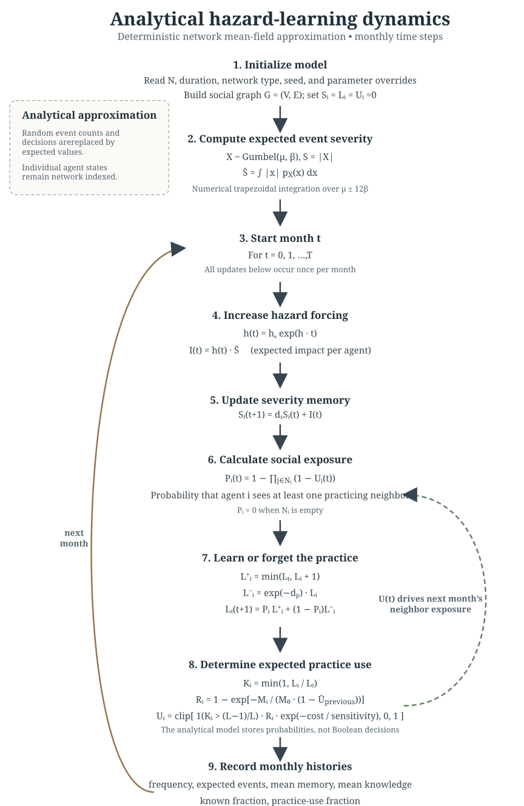
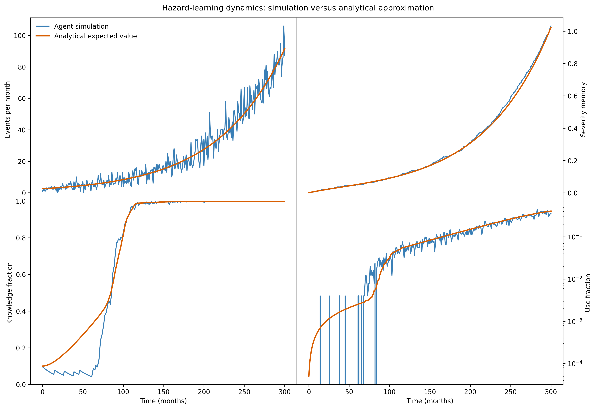
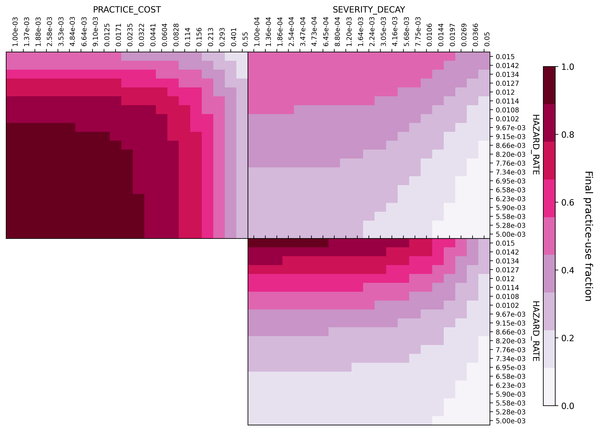

## Overview

The model represents a population of individual agents connected by a social network. Each agent has:
- a memory of accumulated hazard impacts;
- a level of knowledge of a mitigation practice;
- a probability of using that practice.

The analytical model removes the random draws from the agent-based simulation while preserving its main mechanisms:
1. exponentially increasing hazard frequency;
2. decaying memory of hazard impacts;
3. learning from practicing neighbors;
4. forgetting when neighbor exposure is absent;
5. reduced practice use caused by practice cost.

The output is an expected trajectory for the population. It is not intended to reproduce one stochastic simulation path exactly. A stochastic simulation fluctuates around the analytical trajectory because it samples event counts, event severities, learning encounters, and practice-use decisions.

## Interpretation and limitations
### What the model represents well

- The direction and timing of hazard-frequency growth;
- accumulation and decay of remembered impacts;
- the effect of network connectivity on diffusion;
- the effect of repeated exposure requirements;
- gradual forgetting without social reinforcement;
- suppression of practice use due to cost.

### What the current analytical model simplifies

- It uses the expected absolute Gumbel severity rather than sampling events;
- all agents receive the same expected hazard impact at each time step;
- neighbor-use events are treated as conditionally independent

The analytical model is a deterministic network approximation. A fully homogeneous mean-field model could replace the individual network states with population averages. A more detailed continuum formulation could use age- or knowledge-structured partial differential equations, especially if the distribution of learning progress is important.

## Parameters

| Parameter                             |        Fidutial | Meaning                                                                             |
| ------------------------------------- | --------------: | ----------------------------------------------------------------------------------- |
| `N_AGENTS` $N$                        |           `250` | Number of individual agents.                                                        |
| `DURATION_MONTHS` $T$                 |           `240` | Number of monthly time steps.                                                       |
| `TIME_STEP_MONTHS` $t_s$              |             `1` | Nominal time-step size. The current script advances one month per loop.             |
| `NETWORK_TYPE` $n_t$                  | `"small_world"` | Network type: `small_world`, `erdos_renyi`, or `complete`.                          |
| `NETWORK_NEIGHBORS` $n^\mathcal{N}$   |            `24` | Initial ring degree for the small-world network. Must be even and below `N_AGENTS`. |
| `NETWORK_REWIRE_PROBABILITY` $n_r$    |          `0.05` | Probability of rewiring a small-world edge.                                         |
| `NETWORK_EDGE_PROBABILITY` $n_e$      |          `0.04` | Edge probability for an Erdős-Rényi network.                                        |
| `HAZARD_INITIAL_FREQUENCY` $h_0$      |          `0.01` | Initial hazard-event frequency per agent per month.                                 |
| **`HAZARD_RATE`** $h_r$               |         `0.012` | Exponential hazard-growth rate per month.                                           |
| `NEV_MU` $\mu$                        |           `0.0` | Location parameter of the Gumbel severity distribution.                             |
| `NEV_BETA` $\beta$                    |           `0.1` | Scale parameter of the Gumbel severity distribution.                                |
| **`SEVERITY_DECAY`** $d_s$            |         `0.015` | Monthly decay rate of severity memory.                                              |
| `KNOWN_FRACTION` $f_{\mathrm{known}}$ |          `0.05` | Fraction of agents that are always fully knowledgeable.                             |
| `LEARNING_TIMES` $L_t$                |           `4.0` | Learning exposures required to reach full knowledge.                                |
| **`PRACTICE_DECAY`** $d_p$            |          `0.04` | Monthly forgetting rate when there is no neighbor exposure.                         |
| **`PRACTICE_COST`** $C$               |          `0.35` | Cost of practice use.                                                               |
| `COST_SENSITIVITY` $C_s$              |           `0.5` | Scale controlling how strongly cost suppresses practice use.                        |
| `MEMORY_RESPONSE_SCALE` $M_0$         |           `1.0` | Scale of the response to remembered hazard impact.                                  |

## Network
  
The population is represented by an undirected graph:
$$
G = (V, E),
$$
where:
- $V = \{1, \ldots, N\}$ is the set of agents;
- $E$ is the set of social connections

The analytical model retains individual values on the graph ( $E_i$ as the neighbor set of agent $i$.), so it is a network mean-field approximation rather than a fully homogeneous population model.

### Small-world network

The default network starts as a ring lattice. Each agent is connected to  $n^\mathcal{N}$  nearby agents, then edges are rewired with probability $n_r$ at each time step.

### Other network architectures

The implementation also supports:
- Erdős-Rényi: each possible edge is included independently with probability `NETWORK_EDGE_PROBABILITY`;
- complete: every agent is connected to every other agent.

## Time and state variables
Time is measured in months:
$$
t = 0, 1, 2, \ldots, T,
$$
where $T$ is `DURATION_MONTHS`.

For every agent $i$, the analytical model computes each month:
- $S_i(t)$: remembered severity impact;
- $L_i(t)$: learning progress;
- $K_i(t)$: normalized practice knowledge;
- $U_i(t)$: expected probability of using the practice;
- $P_i(t)$: probability of exposure to at least one practicing neighbor.

The implementation stores the vectors $S(t)$, $L(t)$, and $U(t)$.

## Step 1: Hazard frequency

The hazard frequency per agent grows exponentially with time:
$$
h(t) = h_0 e^{h_r t},
$$
where:
- $h_0$ is `HAZARD_INITIAL_FREQUENCY`;
- $h_r$ is `HAZARD_RATE`;
- $t$ is time in months.

The hazard function will be modified to be just linear growth, flat and decreasing.

The expected total number of events in the population is:
$$
\mathbb{E}[N_{\mathrm{events}}(t)] = N h(t),
$$
where $N$ is `N_AGENTS`.

## Step 2: Expected event severity

  In the stochastic model, an event severity is sampled as the absolute value of a Gumbel random variable:
$$
X \sim \operatorname{Gumbel}(\mu, \beta),
$$
$$
S = |X|.
$$
The Gumbel density is:
$$
p_X(x) = \frac{1}{\beta}
\exp\left[-\left(z + e^{-z}\right)\right],
\qquad
z = \frac{x-\mu}{\beta}.
$$
The analytical model computes the expected absolute severity numerically:
$$
\bar{S} = \mathbb{E}[|X|]
= \int_{-\infty}^{\infty} |x| p_X(x)\, dx.
$$
  
on the interval:
$$
[\mu - 12\beta,\; \mu + 12\beta].
$$

## Step 3: Expected monthly impact

The expected number of events per agent is $f(t)$, and the expected severity per event is $\bar{S}$. Therefore, the expected monthly impact per agent is:
$$
I(t) = h(t)\bar{S}.
$$
This value is deterministic and identical for all agents during a given month. The model does not sample individual event counts or severities.

## Step 4: Severity-memory update

Memory decays exponentially between time steps. 

The memory recurrence is:
$$
S_i(t+1) = d_s S_i(t) + I(t),
$$
where $d_s$ is `SEVERITY_DECAY`.

Because all agents receive the same expected impact in the analytical solution, and start with zero memory, the analytical memory values remain equal in the current implementation, so there is no need to distinguish between agents.
However, we keep the vector form for now because it allows future heterogeneous exposure or network-dependent hazard forcing:

The population-level history is:
$$
\overline{S}(t) = \frac{1}{N}\sum_{i=1}^N S_i(t).
$$

## Step 5: Probability of neighbor exposure

Let $U_j(t)$ be the expected probability that neighbor $j$ uses the practice. Assuming neighbor-use events are conditionally independent, the probability that agent $i$ sees at least one practicing neighbor is:

$$
P_i(t) = 1 - \prod_{j \in E_i}\left(1-U_j(t)\right).
$$
We intitialize $U_j(t)$ as 0, we describe later how $U_j(t)$ is computed.

## Step 6: Learning and forgetting

Learning progress is measured in exposure equivalents. Full knowledge requires `LEARNING_TIMES` $L_t$ exposures

For an exposure event, progress advances by one exposure until $L_t$ is reached
$$
L_i^{+}(t) = \min\left(L_t, L_i(t)+1\right).
$$
When an agent is not exposed to a practicing neighbor, progress decays exponentially.

The no-exposure progress is:
$$
L_i^{-}(t) = d_p L_i(t),
$$
where $d_p$ is `PRACTICE_DECAY`.

Using the previous exposure probability $P_i(t)$, the progress in learning is shaped by a mixture of exposure and forgetting:
$$
L_i(t+1) = P_i(t)L_i^{+}(t) + \left(1-P_i(t)\right)L_i^{-}(t).
$$
An agent is counted as fully knowledgeable while:
$$
L_i(t) \geq L_{t}.
$$
Thus, the learned-agent fraction is:
$$
F_{\mathrm{known}}(t) = \frac{1}{N}\sum_{i=1}^N

\mathbf{1}\left[L_i(t) \geq L_{t}\right].
$$
 Note that agents keep forgetting even if they have learned beyond a threshold.

## Step 7: Knowledgeable,  Hazard response, and Practice cost

#### Knowledge 
An agent knowledge level is:
$$
K_i(t) =  1 \; \text{if} \; \frac{L_i}{L_t} \geq \frac{L_t-1}{L_t},
$$
$$
K_i(t) = 0 \; \text{othrerwise}.
$$
This is meant to be a threshold of knowledge, once an agent is one exposure away to have learned the practice, it is assumed to be able to learn it while practicing one more time.

The population normalized mean knowledge (between 0 and 1) is:
$$
\overline{K}(t) = \frac{1}{N}\sum_{i=1}^N K(t)_i.
$$

**There is a step-like change in the knowledge fraction, think of a way to plot that transition time depending on the parameters:** $d_p$, $L_t$, $n^\mathcal{N}$, kind of network

#### Response

The response to remembered hazard impact is a saturating function:
$$
R_i(t) =  \left[ 1 - \exp\left(-\frac{S_i(t)}{M_0(1-f_u )}\right) \right],
$$
where $M_0$ is `MEMORY_RESPONSE_SCALE` and $f_u$ is the fraction of agents using the practice.

We assume this saturating function for a stronger response when the perceived severity is big and the fraction of agents using the practice is almost total.

#### Cost

The  affordability of the practice is:
$$
A_p = \exp\left(-\frac{C}{C_s}\right),
$$
where:
- $C$ is `PRACTICE_COST`;
- $C_s$ is `COST_SENSITIVITY`.

We selected a exponential adjustment to make $A_p$ dimensionless, and the cost of the practice to be determined relative to a factor of susceptibility to be used. More affordable practices are more likely to be used.

### Step 8: Use practice probability

The expected practice-use probability is:
$$
U_i(t) = \operatorname{clip}\left(K_i(t) \cdot
R_i(t)\cdot A_p, 0,1 \right),
$$
equivalently:
$$
U_i(t) = \operatorname{clip}\left[K_i(t) \left(1-e^{-S_i(t)/(M_0-M_0f_u )}\right)
e^{-C/C_S}, 0,1 \right],
$$
where *clip* means that values higher than 1 become 1, and lower than 0 become 0.
  
The analytical population-level practice-use fraction is the mean expected probability: 
$$
\overline{U}(t) = \frac{1}{N}\sum_{i=1}^N U_i(t).
$$

## Step 0: Initialization

At initialization, for a selected agent count, and network configuration, the analytical model (and stochastic model) select the same initial network and initial knowledgeable agents.
$$
M_i(0) = 0,
\qquad
L_i(0) = 0
$$
For all simulations we have a fraction of agents that always know the practice,  no matter what:
$$
N_{\mathrm{known}}
= \operatorname{round}\left(N \cdot f_{\mathrm{known}}\right),
$$
where $f_{\mathrm{known}}$ is `KNOWN_FRACTION`. 
We have always a minimum amount of agents that know, and could use the practice, so other agents can learn. That would be equivalent to a fraction of agents self teaching the practice or learning it from outside the simulated group.

The selected agents are assigned:
$$
K_i(t) = 1.
$$
The selection is random.

## Step-by-step algorithm

## Results

*Results from an analytical and stochastic simulations. Top-left panel show the number of events per month. Top-right, the average remembered severity of the events. Lower-left, the fraction of the population that knows about a practice to manage the hazard. Lower-right, fraction of agents that use the practice at each month.*

*Use fraction of the practice after 300 months for 3 different pairs of parameters. Each panel shows -in log-log scale--the Parameter exploration for three of the main variables affecting the adoption dynamics of the practice --hazard rate, cost of the practice, memory decay of the severity.*
