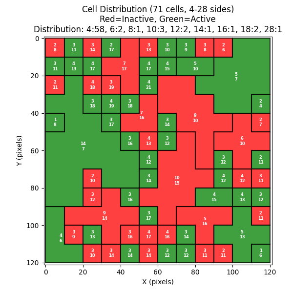
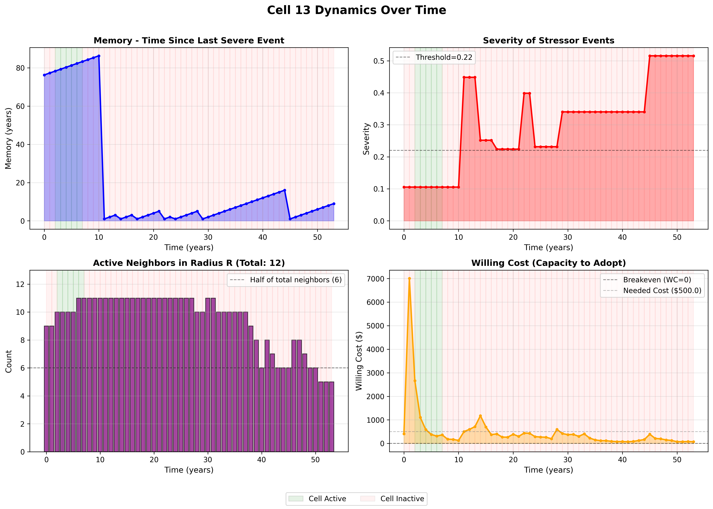
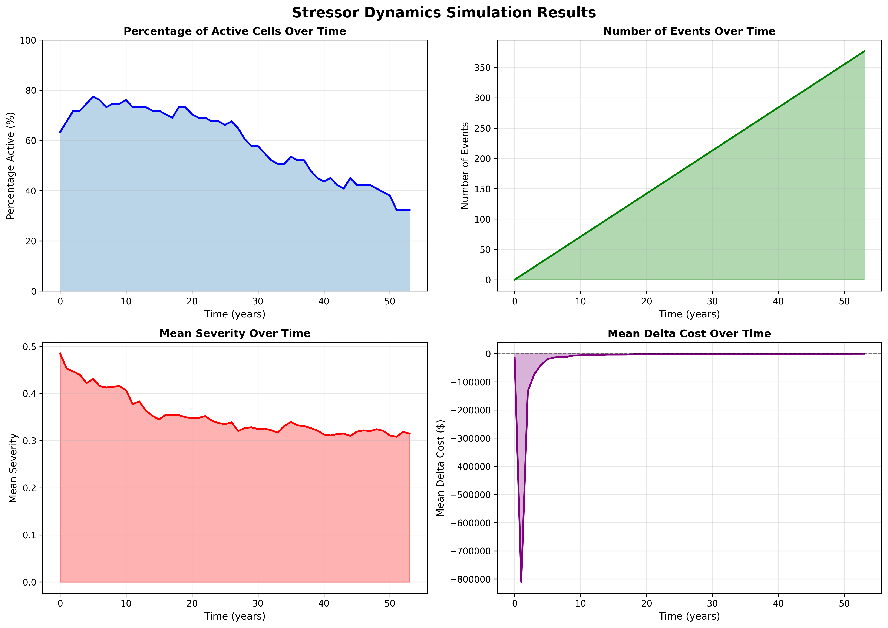

# Stressor Dynamics Simulation Documentation

## Project Overview

This project implements a coupled agent-based model to simulate decision-making dynamics under environmental stress. The model operates on a spatial grid of cells where each cell represents a geographic region. The simulation tracks two interacting processes:

1. **Forcing Dynamics**: Environmental stress (forced stressor events) that accumulate over time
2. **Effort Dynamics**: Adaptive behavior of agents responding to stress through costly interventions

The simulation runs for 50 years, with annual time steps. Each year, stressor events are distributed across cells, triggering adaptive responses based on cost-benefit analysis and social influence.

---

## Configuration

The [config.py](config.py) file centralizes all simulation parameters:

### Cell Grid Parameters
- **RADIUS** (33): Spatial search radius for neighbor interactions
- **SIZE_PIX** (10): Pixel size for cell rendering
- **NX_CELLS** (12): Number of cells in x-direction
- **NY_CELLS** (12): Number of cells in y-direction
- **NMERGE** (22): Parameter for cell merging in grid generation

Adter running
> python3 generate_cells.py

The cells produced are:



### Forcing Dynamics Parameters
- **NEV_MU** (0.0): Mean of Gumbel distribution for event severity sampling
- **NEV_BETA** (0.1): Standard deviation of Gumbel distribution
- **SEV_THRESHOLD** (0.22): Minimum severity to classify as "severe event"
- **DECAY** (3.3): Decay parameter in willing cost calculation

### Effort Dynamics Parameters
- **NSTUBBORN** (0.1): Fraction of cells that never adopt intervention (10%)
- **STUBORNESS** (0.9): Base parameter controlling adoption resistance
- **NEEDED_COST** (500.0): Fixed cost in dollars to activate intervention
- **MAX_CAP** (1.1): Maximum multiplier for capacity distribution (1.1 × NEEDED_COST)
- **YRS_THRES** (3): Number of consecutive years with positive delta cost before deactivation

### Simulation Parameters
- **DURATION_YEARS** (50): Total simulation length in years

---

## Forcing Dynamics

Forcing dynamics generates and distributes environmental stressor events across the spatial grid.

### Mean Field Stressor Events

The total number of events in year $t$ grows linearly:

$$N_{\text{events}}(t) = \frac{N_{\text{cells}}}{10} \cdot t$$

where $N_{\text{cells}}$ is the total number of cells in the grid (144 by default).

### Event Distribution

Events are randomly distributed across cells using a Dirichlet distribution to ensure:
- Sum of cell events = $N_{\text{events}}$
- Each cell receives a portion of total events

### Severity Dynamics

For each cell, severity is sampled from a Gumbel distribution when events occur:

$$S_i(t) \sim |N(0, 1)| \text{ where } N \text{ ~ Gumbel}(\mu = 0, \beta = 0.1)$$

An event is only recorded if severity exceeds the threshold:

$$S_i(t) \geq S_{\text{threshold}} = 0.22$$

### Memory Dynamics

Each cell maintains a "memory" of the time elapsed since the last severe event:

$$M_i(t) = \begin{cases} 0 & \text{if } S_i(t) \geq S_{\text{threshold}} \text{ (just had severe event)} \\ M_i(t-1) + 1 & \text{otherwise (time in years)} \end{cases}$$

Memory is initialized uniformly: $M_i(0) \sim U(0, 1)$


## Effort Dynamics

Effort dynamics determines when agents activate costly interventions based on stress exposure and cost-benefit analysis.

### Cell Characteristics

Each cell has fixed characteristics determined at initialization:

- **Stubbornness**: Each cell is permanently stubborn with probability $N_{\text{stubborn}} = 0.1$
  - Stubborn cells can never activate if currently inactive
  
- **Exposure**: $E_i \sim U(0, 1)$ — vulnerability to stressor events

- **Capacity**: $C_i = U(N_{\text{needed}}, \text{MAX\_CAP} \cdot N_{\text{needed}}) \cdot A_i$
  - Where $A_i$ is the cell's area
  - Represents available resources for intervention

### Willing Cost Calculation

The "willing cost" represents how much the agent is willing to spend, based on current stress exposure:

$$W_i(t) = \frac{E_i \cdot C_i \cdot S_i(t)}{\ln\left(\frac{ M_i(t) \cdot N_{\text{events}}(t)}{D} \right)}$$

where $D = $ DECAY $= 3.3$[yr]

The logarithm prevents singularities and introduces diminishing returns as memory and events accumulate.

### Activation Decision

The agent compares the willing cost to the needed cost:

$$\Delta C_i(t) = N_{\text{needed}} - W_i(t)$$

An agent activates intervention if two conditions are met:

1. **Cost-benefit**: $\Delta C_i(t) < 0$ (willing cost exceeds needed cost)

2. **Social adoption probability**: 
   $$p_{\text{adopt}} = S_{\text{tuborness}} \cdot U(0, 1) > f_{\text{neighbors}}$$
   
   where $f_{\text{neighbors}}$ is the fraction of active neighbors within radius $R$ (RADIUS = 33)

### Deactivation

An active cell deactivates if $\Delta C_i(t) > 0$ for YRS_THRES = 3 consecutive years.

---

## Simulation Output

The simulation generates results and plots showing the coupled dynamics.

### Cell Distribution

Generated by `plot_cells.py` - shows the spatial distribution of cells colored by activation status:
- **Green**: Active cells with intervention deployed
- **Red**: Inactive cells without intervention
- Cells are labeled with neighbor counts (direct neighbors / radius neighbors)

### Cell 13 Dynamics



Detailed time series for a single cell showing:
- Severity over time
- Memory (years since severe event)
- Willing cost and delta cost
- Activation status
- Social influence from neighbors

### Stressor Dynamics Plot



Four subplots showing system-level dynamics:

1. **Percentage of Active Cells**: Fraction of cells with intervention active
   - Shows adoption spreading and deactivation patterns
   
2. **Number of Events**: Total stressor events in the system
   - Increases linearly from 0 at $t=0$ to maximum at $t=50$
   
3. **Mean Severity**: Average event severity across all cells
   - Reflects intensity of stressor exposure
   
4. **Mean Delta Cost**: Average cost difference across cells
   - Negative values indicate willingness to adopt
   - Positive values indicate barrier to continuation

---

## Running the Simulation

### 1. Generate Cell Grid
```bash
python generate_cells.py
```
Generates the spatial grid of cells and saves to `cells_state.pkl`

### 2. Run Simulation
```bash
python stressor_dynamics.py
```
Executes the coupled forcing and effort dynamics, saves results to `stressor_dynamics_results.pkl`

### 3. Generate Plots

Plot cell distribution:
```bash
python plot_cells.py
```

Plot single cell dynamics:
```bash
python plot_single_cell.py
```

Plot system-level stressor dynamics:
```bash
python plot_dynamics.py
```

All plots are saved as PNG files for analysis. 